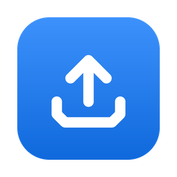

  

<h1 align="center">DropUp</h1>

Drop a file on your menubar. It's on your server.

<a href="https://github.com/bojou/dropup/releases/latest"><b>Download the latest release</b></a>

---

DropUp lives in your menubar and does one thing well: drag a file or a folder onto its icon and it uploads straight to your own FTP or SFTP server.

## Features

- **Drag and drop to upload.** Drop files or whole folders on the menubar icon and they go up right away.
- **Progress at a glance.** The menubar icon shows progress while uploading and a check when it's done.
- **Pause, resume and retry.** Lost your connection or quit halfway? Pick up where you left off.
- **Browse your server.** Look around, download, rename, move and organize files like in Finder.
- **Keyboard shortcuts.** Upload what's selected in Finder, what's on your clipboard, or your latest screenshot.
- **FTP and SFTP.** Sign in with a password or an SSH key. Passwords stay in your Keychain.
- **Stays out of the way.** No Dock icon, no windows you didn't ask for, and it updates itself.

## Download

Get the latest version from the [Releases page](https://github.com/bojou/dropup/releases/latest), open the DMG and drag DropUp into Applications. It's signed and notarized by Apple, so it opens without warnings.

## Requirements

macOS 14 Sonoma or later.
